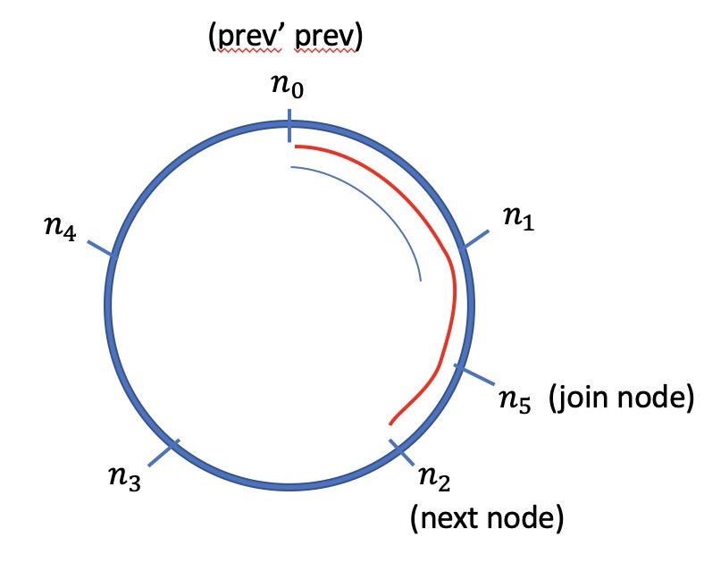
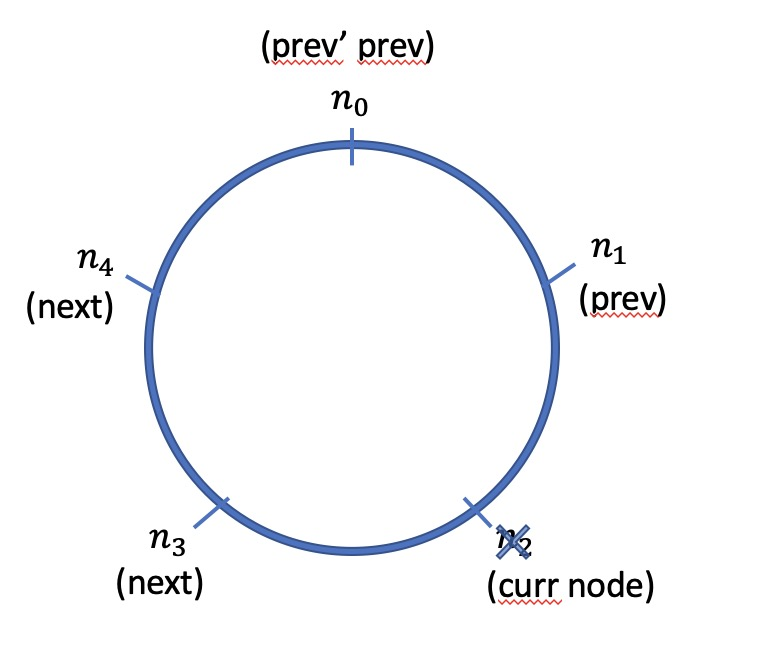

## Overview
After lab 3, our bin storage system is a scalable, concurrent and fault-tolerance tribble system to support multiple users using the tribble service. This system comes up from four parts: Front-end, BinStorage Client, Backend Storages and keepers. In the following, I will introducing the design idea of each part.

### Front-end
The front-end kept same as our lab2, which just receieves the BinStorage Client we create. It contains the created client wrapper.

### Backend Storage
The backend storage is left as same as lab2 to do the default storage service.

### BinStorage Client

To achieve the fault-tolerance feature in our system, we need to store a data in multiple places. In our design, we try to store a data in primary and backup two places. Hence, in BinStorage Client, rather than just providing one storage destination, it provides two storages as primary and backup which returned by the bin(name) function. The bin function will use the bin name and double hash strategy to find two backend addresses. Also, the BinStorage Client will maintain a status table to record the status of all backends. 

When the BinStorage Client starts, it will first scan all backends to update the status table of backends. Then it will return a storage wrapper which contains two storage to the front-end.

There are three category of operations the front-end would do: get, set and clock.

For the get operation, it contains get, keys, list_get, list_keys functions. When they try to retrieve data, they will get data from two storages and then compare the clock value of two backends. It will return the value in the backend which has a larger clock value. It prevents from data inconsistency.

For the set operation, it contains set, list_append, list_remove, functionsit. They write data in primary and backup two backends. If both of them success, it receieves confirmation from them and commit this operation to backends. When it receieves second commit confirmation message, it returns success to user. When one backend crashed during the set or a new node join, it will consult the primary keeper's log to find whether or where it should write this data. 

For the clock operation, when the user does POST operation, it will synchronize the clock value of two backends it communicates with the larger clock value. 

Each 10 seconds, it will scan all backends to update the status table. 

### Keeper

Now there should be multiple keepers working at the same time.

A keeper should have two main responsibilities : 1. Synchronize the clock value of all backends. 2. When any backends join or leave, the keeper needs to help them do data migration to maintain at least multiple replicas at different backends.

In our design, we just select one keeper to be the primary keeper to do the above jobs. We know there would be performance issues to let one keeper serving all backends, but due to the possibility of a keeper may crash and need other keepers to continue its work, a single  primary keeper design would be much easier comparing to each keeper taking charge of part of backends. If multiple keepers are serving backends at the same time, when a new keeper crash or join, it needs dynamic allocation of backends, which needs more detailed design. Hence, we want to first realize an easier version.

In the serve_keeper function, we create three threads by “select!” to maintain three things at same time: 1. Initiate a server service for rpc call. 2. The main logic of a keeper which will be described in following. 3.  A thread to receive the shutdown signal.

We deigned keep.proto for communications between keepers through rpc call. In each keeper, it stores its index and the primary keeper of  this view. At the start of initiation, all keepers send their index to others, and they use the same strategy as selecting the minimum alive index keeper to be the leader. The leader knows itself is the leader by knowing it is the least index.

After the leader has been selected, each keeper updates its knowing leader in its client. The following keepers will just send heartbeat message to the leader each second to check whether the leader is alive. The heartbeat process will block the following keeper within loop. And the leader keeper will take charge of the responsibilities of the keeper. 

When a following keeper crashes, it wouldn’t affect the functionality of this view, so nothing to do. When the leader keeper crashes, other following keepers will realize it by failing connection the leader. Then, all alive keepers will reselect the leader by exchanging their index.

When a new keeper join the view, as long as the current view has a leader and the leader is still alive, it won’t do anything but just sending heartbeat message to the leader, even though it has a lower index. When the current leader crashes, it joins the next leader election and continue as a normal keeper.

As the current leader keeper, it will do the following jobs.

First, it syncs the clock value of all backends as it did in lab2. It retrieves the clock value from all backends and send the maximum one back to each backend.

Second, it does data migration when a backend joins or leaves the view. Details are following.

#### Primary Keeper
Once a keeper runs as a primary, it first scans every backend and stores their status into a local table. The table contains one entry for one backend, and each entry stores backend’s address and status (up or down): `{ addr: String, status: bool }`.

Second, from this table, try to find a previous one by the hash value computed from backend storage. If an old version does exist, replace the local one with the previous version. If not, store the local table into backend storage.

Third, it continues to scan all backends,  and compares each status to the local stored table to be notified of node joining or node leaving, then performs data migration based on whether a node joins or leaves. Store updated status table into storage after this has been done.

Sleep for 3 seconds and then continue scanning backend servers.

This method naturally solves the problem of data migration being interruptted. If a keeper crashes during data migration, the table won’s be updated. Once the next keeper is up, it fetches the previous table and scans backends. It will figure out whether a node has joined or leaved, and will do data migration once again if needed. Therefore, data migration are ensured to be done.

#### Find Storage

As mentioned before, the keeper has a local storage table maintaining status for all backens. Each time it needs to fetch or store something, it calculates the hash value and corresponding backend. If the backend happens to be down, simple do linear search to find the next available backend, which is supposed to store the data you need. Same thing for finding replica: do linear search to find the next live backend after primary backup.

#### Data Migration

There are two cases for data migration: node joining and node leaving. No matter which case it is, the key idea to implement fault tolerance is: **each node stores data from range (previous’ previous node, current node]**

For node joining, it is like to insert a node into the cycle. The data range it stores is (prev’ prev, current node] — (n_0, n_5]). This range is contained in (prev’s prev, next node] — (n_0, n_2], which is stored on the next node. Therefore, for node joining, the only thing to do is copy data from `next node` to `current joining node`.

For node leaving, it is like removing a node from the cycle. This event affects the storage on the leaving node’s `next` and `next' next`. The `next' next` copies data from `next` of range (prev, curr] — (n_1, n_2], and the `next` copies data from `prev` of range (prev’ prev, perv] — (n_0, n_1]. Note that order cannot be changed here, as `next` node should change after the other has copied from it.

